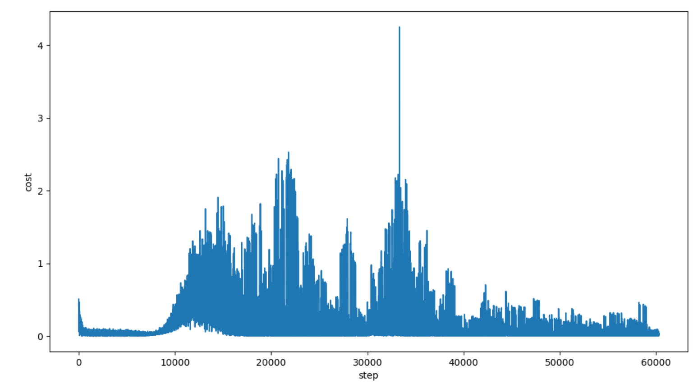

```python
drivers_num, passengers_num = 30, 60
env = Environment(drivers_num=drivers_num, passengers_num=passengers_num)
n_actions = len(env.candidateActions)
n_features = passengers_num

MEMORY_SIZE = 5000
RL = DQNPrioritizedReplay(
    n_actions=n_actions, n_features=n_features, learning_rate=0.0002, reward_decay=0.9, e_greedy=0.9, e_greedy_increment=0.00005, memory_size=MEMORY_SIZE)
train_base = 3
train_bais = MEMORY_SIZE
```


```python
# requests_1
drivers_num, passengers_num = 50, 100
env = Environment(drivers_num=drivers_num, passengers_num=passengers_num)
n_actions = len(env.candidateActions)
n_features = passengers_num

MEMORY_SIZE = 5000
RL = DQNPrioritizedReplay(
    n_actions=n_actions, n_features=n_features, learning_rate=0.0002, reward_decay=0.9, e_greedy=0.9, e_greedy_increment=0.00005, memory_size=MEMORY_SIZE)
train_base = 5
train_bais = MEMORY_SIZE
```

```
episode = 20000
CFA: 135.14646783962678
DRL: 216.27114426730228
```


```python
# requests_2 调整train_base
drivers_num, passengers_num = 50, 100
env = Environment(drivers_num=drivers_num, passengers_num=passengers_num)
n_actions = len(env.candidateActions)
n_features = passengers_num

MEMORY_SIZE = 5000
RL = DQNPrioritizedReplay(
    n_actions=n_actions, n_features=n_features, learning_rate=0.0002, reward_decay=0.9, e_greedy=0.9, e_greedy_increment=0.00005, memory_size=MEMORY_SIZE)
train_base = 10
train_bais = MEMORY_SIZE
```


```python
# requests_3 调整MEMORY_SIZE
drivers_num, passengers_num = 50, 100
env = Environment(drivers_num=drivers_num, passengers_num=passengers_num)
n_actions = len(env.candidateActions)
n_features = passengers_num

MEMORY_SIZE = 10000
RL = DQNPrioritizedReplay(
    n_actions=n_actions, n_features=n_features, learning_rate=0.0002, reward_decay=0.9, e_greedy=0.9, e_greedy_increment=0.00005, memory_size=MEMORY_SIZE)
train_base = 10
train_bais = MEMORY_SIZE
```




requests_4: 107.99


requests_5: 169.1


