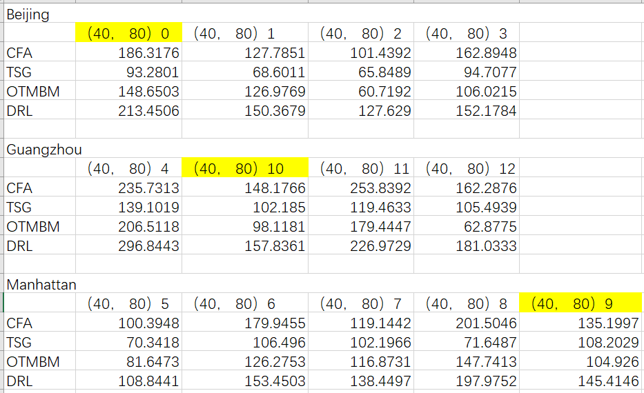
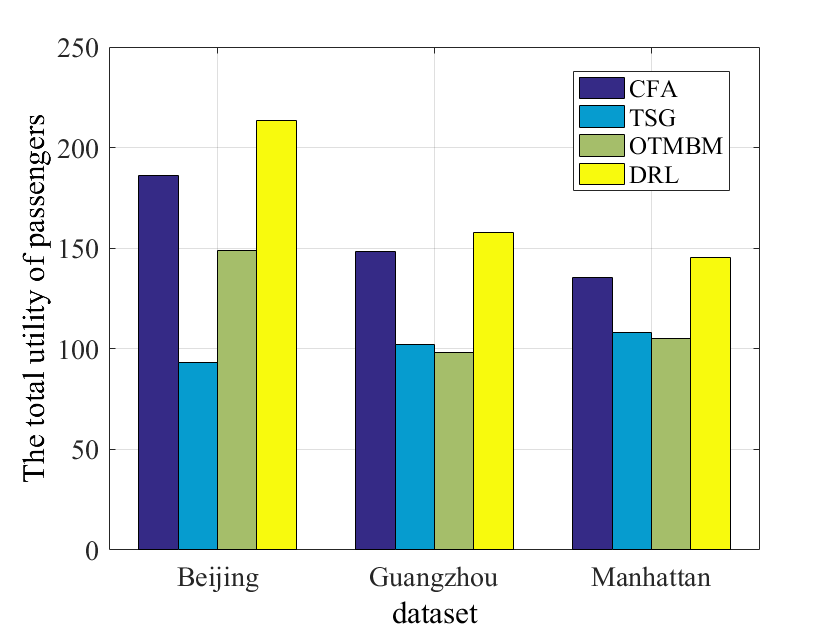

# drivers =  40, passengers = 80

#### Accumulated rewards of Beijing（40，80)-0

-0.png)

#### Cost of Beijing (40，80)-0

-0.png)

####  Accumulated rewards of Guangzhou（40，80)-10

-10.png)

#### Cost of Guangzhou（40，80)-10 

-10.png)

#### Accumulated rewards of Manhattan（40，80)-9 

-9.png)

#### Cost of  Manhattan（40，80)-9

-9.png)

